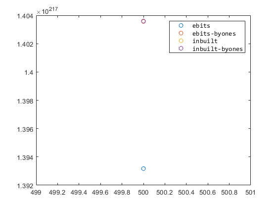
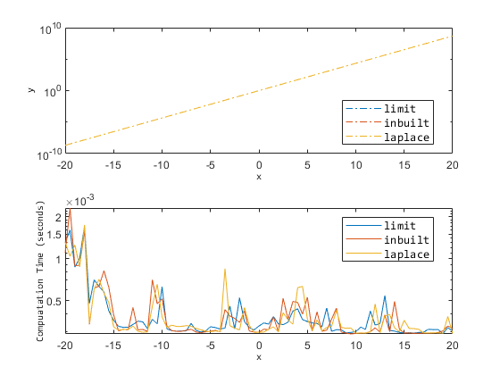

# EXPALTS

**ALTERNATIVE APPROXIMATIONS OF THE NATURAL EXPONENTIAL FUNCTION**

The **`expalts`** `class` provides the following `real` to `real` functions 

## Case: `MATLAB`

```matlab:Code
xsel = [-100, 0, 1, 10, 100, 500];
x = xsel(end);
```

**`1.`**** **`ebits`**: nat. exponentiation **by **bit-shifting and base-2 integer squaring approximation of the limit theorem**

```matlab:Code
y1 = expalts.ebits(x);
y3 = exp(x);
```

**`2.`** `byones:`** gradual nat. exponentation**: - useful for balance in speed and improved accuracy, esp. in resource-constrained embedded systems, by restricting input exponentiation to small values of 1s.

**`2.1.`** **gradual: ebits**

```matlab:Code
y2 = expalts.byones(x, 0); 
% or 
% y2 = expalts.byones(x,0); 
```

**`2.2.`** **gradual: inbuilt exp.**

```matlab:Code
y4 = expalts.byones(x,1); 
```

**`Plot Comparisons`**

```matlab:Code
figure; plot(x,[y1; y2; y3; y4],'o');
legend({'ebits','ebits-byones','inbuilt','inbuilt-byones'},...
    'FontName','Consolas', 'FontSize',10);
```



## Case: Calling `C++` Library in MATLAB

```matlab:Code
expo = clib.expalts.expalts();
y1 = expo.ebits(x);
y3 = expo.byones(x,0);
% Plots
figure; plot(x,[y1; y2; y3; y4],'o');
legend({'ebits','ebits-byones','inbuilt','inbuilt-byones'},...
    'FontName','Consolas', 'FontSize',10);
```



# Important Folders
### Matlab Source Folder

`./src_m`

`./src_m_cpp`

  
### `C++` Source Folder

`./src_cpp`

  
### Python Bindings Folder

`./src_py`
