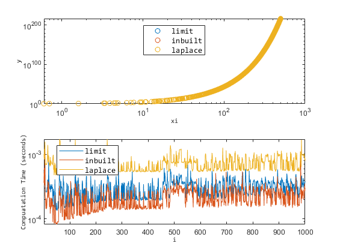

# EXPALTS

**ALTERNATIVE APPROXIMATIONS OF THE NATURAL EXPONENTIAL FUNCTION**

The **`expalts`** `class` provides useful functions to compute natural exponentiation in a gradual fashion.

# **Gradual natural exponentation**

   -  useful for balance in speed and improved accuracy, esp. in resource-constrained embedded systems 
   -  achieves this by restricting input exponentiation to small values less than or equal to 1. 

## Case: `MATLAB`

Directory:` ./src_m`

```matlab:Code(Display)
y = expalts.bones(x,mode)
```

```matlab:Code
% x is the input value
% y is the output value
```

**`mode`**

   -  **0: limit-theorem (by bit-shifts and integer squaring) approximation.** 
   -  **1: in-built approximation** 
   -  **2: laplace (loop) approximation** 

```matlab:Code
xsel = (0:0.1:500)'; %[-100, 0, 1, 10, 100, 500]';
x = xsel;
t0 = zeros(1000,1); t1 = t0; t2 = t0; xi = t0;
for i = 1:1000
    % xi = x; % vectorized speed
    xi(i) = xsel( randi([1 numel(xsel)],1) ); % scalar speed
```

**`2.1.`** **gradual: limit theorem approx.**

```matlab:Code
    tic; y0 = expalts.bones(xi,0); t0(i) = toc;
```

**`2.2.`** **gradual: in-built language implementation.**

```matlab:Code
    tic; y1 = expalts.bones(xi,1); t1(i) = toc;
```

**`2.2.`** **gradual: laplace approx.**

```matlab:Code
    tic; y2 = expalts.bones(xi,2); t2(i) = toc;
end
```

**`Plot Comparisons`**

```matlab:Code
% Plots
t = tiledlayout('flow');
nexttile; plot(xi,[y0 y1 y2],'o');
legend({'limit','inbuilt','laplace'},...
    'FontName','Consolas', 'FontSize',10,'Location',"best");
ax = gca; ax.XScale = 'log'; ax.YScale = 'log';
ylabel("y",'FontName','Consolas', 'FontSize',8);
xlabel("xi",'FontName','Consolas', 'FontSize',8);
nexttile; plot([t0 t1 t2]);
ylabel("Compuatation Time (seconds)",'FontName','Consolas', 'FontSize',8);
xlabel("i",'FontName','Consolas', 'FontSize',8);
legend({'limit','inbuilt','laplace'},...
    'FontName','Consolas', 'FontSize',10,'Location',"best");
ax = gca; ax.YScale = 'log';
axis("tight")
```



## Case: Calling `C++` Library in MATLAB

Directory:` ./src_m_cpp`

```matlab:Code
xsel = -20:0.5:20;
x = xsel(1:end);
y0 = zeros(numel(x),1); y1 = y0; y2 = y0;
t0 = y0; t1 = t0; t2 =t0;
for i = 1:numel(x)
    tic
    y0(i) = clib.expalts.expalts().bones(x(i),0);
    t0(i) = toc;
    tic
    y1(i) = clib.expalts.expalts().bones(x(i),1);
    t1(i) = toc;
    tic
    y2(i) = clib.expalts.expalts().bones(x(i),2);
    t2(i) = toc;
end
% Plots
t = tiledlayout('flow');
nexttile; plot(x,[y0 y1 y2],'-.');
legend({'limit','inbuilt','laplace'},...
    'FontName','Consolas', 'FontSize',10,'Location',"best");
ax = gca; ax.YScale = 'log';
ylabel("y",'FontName','Consolas', 'FontSize',8);
xlabel("x",'FontName','Consolas', 'FontSize',8);
nexttile; plot(x,[t0 t1 t2]);
ylabel("Compuatation Time (seconds)",'FontName','Consolas', 'FontSize',8);
xlabel("x",'FontName','Consolas', 'FontSize',8);
legend({'limit','inbuilt','laplace'},...
    'FontName','Consolas', 'FontSize',10,'Location',"best");
ax = gca; ax.YScale = 'log';
axis("tight")
```


# Other Source Directories
### `C++` Source Folder

Directory:` ./src_cpp`

```matlab:Code(Display)
static double expalts::bones(double x, unsigned char mode);
```

See `main.c`

### Python Bindings Folder

Directory:` ./src_py`

See `test.py`

### **Author**

`Oluwasegun Somefun (OAS)`

`<oasomefun@futa.edu.ng, somefuno@oregonstate.edu> . 2021.`
