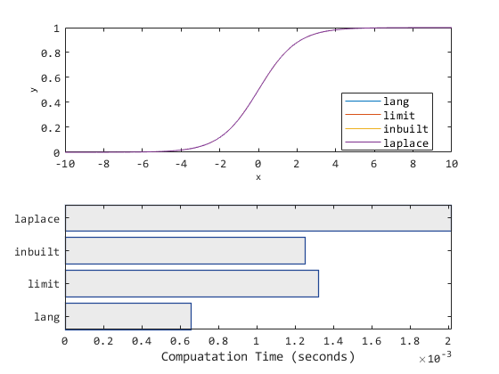

# EXPALTS: ALTERNATIVE NATURAL EXPONENTIAL COMPUTATIONS
### Author: Oluwasegun Somefun (OAS)

`<oasomefun@futa.edu.ng, somefuno@oregonstate.edu>`

First Version: `2020`.

Revisions: `2021`

```matlab:Code
% UseCase: Test

x = -1000:0.01:1000;

% - inbuilt
y1 = 1./(1+exp(-0.1.*x));
%
% - bit-shift and integer squaring approximation of the limit theorem
y2 = 1./(1+expalts.ebits(-0.1.*x));
%
% - gradual exponentation: - useful for improved accuracy
%   esp. in resource-constrained embedded systems.
y4 = 1./(1+expalts.byones(-0.1.*x, 0)); % gradual y2
y2 = 1./(1+expalts.byones(-0.1.*x, 1)); % gradual y1
%
figure(76); 
stackedplot(x,[y1; y2; y3; y4]', "DisplayLabels", {'y1','y2','y3','y4'}); 
grid on;
```



```matlab:Code

```
